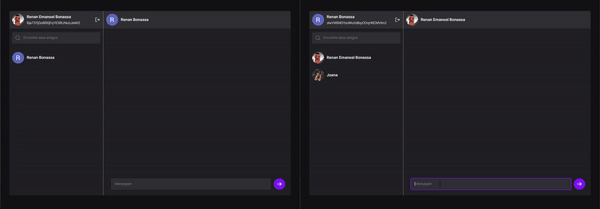

# Chat Cogna

Este projeto foi desenvolvido como parte do processo seletivo para a empresa Cogna,

<p align="center">
  
</p>

## Ferramentas utilizadas
- `React JS`
- `Vite`
- `Typescript`
- `Firebase`
- `Tailwind`
- `Radix UI`
- `Figma`

## Protótipos
A prototipação das telas foi feita com a ferramenta `Figma` e seus design estão disponíveis [aqui](https://www.figma.com/file/vkJdGi0OwKi3QrAcO2WF74/Cogna?node-id=0%3A1)

<iframe style="border: 1px solid rgba(0, 0, 0, 0.1);" width="800" height="450" src="https://www.figma.com/embed?embed_host=share&url=https%3A%2F%2Fwww.figma.com%2Ffile%2FvkJdGi0OwKi3QrAcO2WF74%2FCogna%3Fnode-id%3D0%253A1" allowfullscreen>
</iframe>

### Transformação de um SVG em um componente React
Usando o site [`transform.tools`](https://transform.tools/) é possível copiar o logo SVG do React lá do Figma, e transformar em um componente React para utilizar na interface

## Criação do projeto React com Vite
Através do `Vite` é possivel criar um programa `React` já configurado para utilizar o `Typescript` e sendo muito mais performático que o create-react-app tradicional
```bash
  npm create vite@latest

  react
  typescript
```

## Criação de rotas
Para o uso de rota e a criação de multiplas página, foi utilizado o `react-router-dom` na versão 5
```bash
  npm install react-router-dom@5
  
  npm i --save-dev @types/react-router-dom
```

## Firebase
Para a criação do backend da aplicação (Autenticação e Database) foi utilizado o BaaS (Backend as a Service) `Firebase` utilizando a última versão 9.

## Tailwind
Para configuração do tailwind no projeto [clique aqui](https://tailwindcss.com/docs/guides/vite):
```bash
  npm install -D tailwindcss postcss autoprefixer

  npx tailwindcss init -p
```

Também foi utilizado um plugin do tailwind para estilização das scrollbars
```bash
  npm install --save-dev tailwind-scrollbar
```

Para utilizar a aplicação condicional de classes Tailwind, iremos utilizar a bib [CLSX](https://www.npmjs.com/package/clsx)
```bash
  npm install --save clsx
```

## Radix UI
O radix é uma biblioteca de componentes primitivos não estilizados, que falicita a criação de componentes nativos complexos como Checkbox e Modais de uma maneira mais simples facil e levando critérios de acessibilidade em consideração

```bash
  npm install @radix-ui/react-checkbox

  npm install @radix-ui/react-slot
```

## Icones
Para a utilização de icones na aplicação, foram utilizadas duas bibliotecas de icones `Heroicons` e `Phosphor Icons`
```bash
  npm install @heroicons/react

  npm install --save phosphor-react
```

## Toasts
Foi utilizado a biblioteca `react-toastify` para emissão de toasts
```bash
  npm install --save react-toastify
```